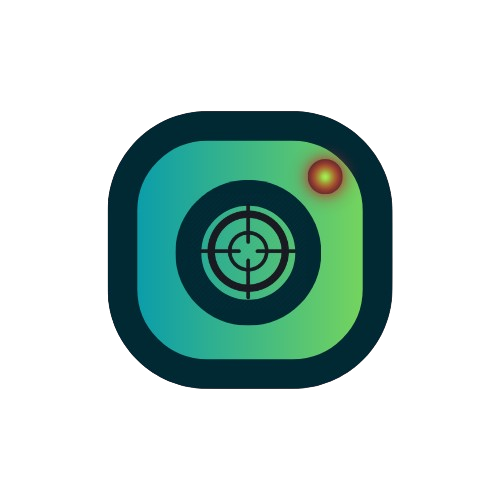

<div align="center">



# FocusGram

<<<<<<< Updated upstream
[](LICENSE)
[](https://flutter.dev)
[](https://github.com/ujwal223/focusgram/releases)
=======
**Use social media on your terms.**
>>>>>>> Stashed changes

[](LICENSE)
[](https://flutter.dev)
[](https://github.com/ujwal223/focusgram/releases)
[](https://f-droid.org)

[Download APK](https://github.com/ujwal223/focusgram/releases) · [View Changelog](CHANGELOG.md) · [Report a Bug](https://github.com/ujwal223/focusgram/issues)

</div>

---

Most people don't want to quit Instagram. They want to check their messages, post a story, and leave — without losing an hour to Reels they never meant to watch.

FocusGram is an Android app that loads the Instagram website with the distracting parts removed. No private APIs. No data collection. No accounts. Just a cleaner way to use a platform you already use.


---

## What it does

**Focus tools**

- Block Reels entirely, or allow them in timed sessions (1–15 min) with daily limits and cooldowns
- Autoplay blocker — videos don't play until you tap them
- Minimal Mode — strips everything down to Feed and DMs

**Content filtering**

- Hide the Explore tab, Reels tab, or Shop tab individually
- Disable Explore and suggested content entirely
- Disable Reels Entirely

**Habit tools**

- Screen Time Dashboard — daily usage, 7-day chart, weekly average
- Grayscale Mode — reduces the visual pull of colour; can be scheduled by time of day
- Session intentions — optionally set a reason before opening the app

**The app itself**

- Feels (almost) like a native app, not a browser.
- No blank loading screen — content loads in the background before you get there
- Instant updates via pull-to-refresh
- Dark mode follows your system

---

## Installation

### Direct download
1. Go to the [Releases](https://github.com/ujwal223/focusgram/releases) page
2. Download `focusgram-release.apk`
3. Open the file and allow "Install from unknown sources" if prompted

### F-Droid
Submission is in progress. Updates will publish automatically once accepted.

---

## Privacy

FocusGram has no access to your Instagram account credentials. It loads `instagram.com` inside a standard Android WebView — your login goes directly to Meta's servers, the same as any mobile browser.

- No analytics
- No crash reporting
- No third-party SDKs
- No data leaves your device
- All settings and history are stored locally using Android's standard storage APIs

---

## Frequently asked questions

**Will this get my account banned?**
Unlikely. FocusGram's traffic is indistinguishable from someone using Instagram in Chrome. It does not use Instagram's private API, does not automate any actions, and does not intercept credentials. See the technical details below for specifics.

**Is this a mod of Instagram's app?**
No. FocusGram is a separate app that loads `instagram.com` in a WebView. It does not modify Instagram's APK or use any of Meta's proprietary code.

**Why is it free?**
Because it should be. FocusGram is built and maintained by [Ujwal Chapagain](https://github.com/Ujwal223) and released under AGPL-3.0.

---

## Building from source

<details>
<summary>Technical details and build instructions</summary>

### Requirements
- Flutter stable channel (3.38+)
- Android SDK

### Build
```bash
flutter pub get
flutter build apk --release
```

### Architecture
FocusGram uses a standard Android System WebView to load `instagram.com`. All features are implemented client-side via:
- JavaScript injection (autoplay blocking, metadata extraction, SPA navigation monitoring)
- CSS injection (element hiding, grayscale, scroll behaviour)
- URL interception via NavigationDelegate (Reels blocking, Explore blocking)

Nothing is modified server-side. The app never reads, intercepts, or stores Instagram content beyond what is explicitly listed (Reel URL, title, and thumbnail URL for the local history feature).

### Permissions
| Permission | Reason |
|---|---|
| `INTERNET` | Load instagram.com |
| `RECEIVE_BOOT_COMPLETED` | Keep session timers accurate after device restart |

### Stack
| | |
|---|---|
| Framework | Flutter (Dart) |
| WebView | flutter_inappwebview (Apache 2.0) |
| Storage | shared_preferences |
| License | AGPL-3.0 |

</details>

---

## Legal disclaimer

FocusGram is an independent, free, and open-source productivity tool licensed under AGPL-3.0. It is not affiliated with, endorsed by, or associated with Meta Platforms, Inc. or Instagram in any way.

**How it works:** FocusGram embeds a standard Android System WebView that loads `instagram.com` — the same website accessible in any mobile browser. All user-facing features are implemented exclusively via client-side modifications and are never transmitted to or processed by Meta's servers.

**What we do not do:**
- Use Instagram's or Meta's private APIs
- Intercept, read, log, or store user credentials, session data, or any content
- Modify any server-side Meta or Instagram services
- Scrape, harvest, or collect any user data
- Claim ownership of any Meta or Instagram trademarks, logos, or intellectual property — any branding visible within the app is served directly from `instagram.com` and remains the property of Meta Platforms, Inc.

Using FocusGram is functionally equivalent to accessing Instagram through a mobile web browser with a content blocker extension. By using FocusGram, you acknowledge that you remain bound by Instagram's own Terms of Service.

For legal concerns, contact `notujwal@proton.me` before taking any other action.

---

## License

Copyright © 2025 Ujwal Chapagain

Licensed under the [GNU Affero General Public License v3.0](LICENSE). You are free to use, modify, and distribute this software under the same terms.
