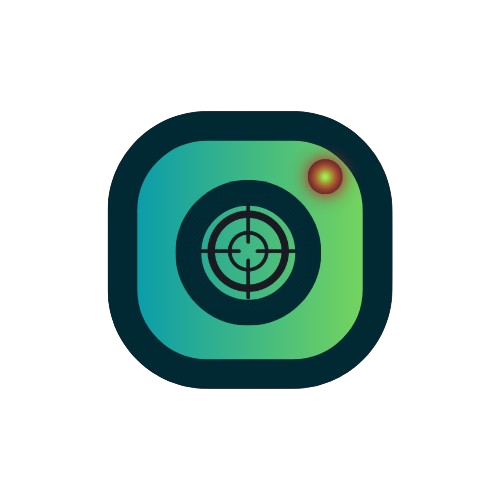

<div align="center">



# FocusGram

**Use social media on your terms.**

[](LICENSE)
[](https://flutter.dev)
[](https://github.com/ujwal223/focusgram/releases)

<a href='https://focusgram.en.uptodown.com/android' title='Download FocusGram'>
  
</a>

[Download APK](https://github.com/ujwal223/focusgram/releases) · [View Changelog](CHANGELOG.md) · [Report a Bug](https://github.com/ujwal223/focusgram/issues/new)

</div>

---

Most people don't want to completely quit Instagram but control its usage (i.e They want to check their messages, post a story, and leave) without losing many hours to Reels and distracting content they never meant to watch.

FocusGram is an Android-only app that loads the Instagram website with the distracting parts removed and with Extra features. No private APIs. No data collection. Just a cleaner way to use a platform you already use.

> FocusGram is free and always will be. If it's saved you some time, show your support by buying me a momo 👉👈.
>
> [](https://buymemomo.com/ujwal)


---

## What it does

**Focus tools**

- Block Reels entirely, or allow them in timed sessions (1–30 min) with daily limits and cooldowns
- Minimal Mode strips everything down to Feed and DMs
- Hide ALL feed posts entirely.

**Content filtering**

- Hide the Explore tab or Reels tab individually
- Disable Explore and blur posts, videos on feed entirely
- Click to unblur feed posts
- Disable Reels entirely
- Disable scrolling of home feed

**Habit tools**

- Screen Time Dashboard: daily usage, 7-day chart, weekly average
- Grayscale Mode: reduces the visual pull of colour; can be scheduled by time of day
- Session intentions: optionally set a reason before opening the app
- Reel & App Quota: Allocate only certain time for reels and/or instagram

**Other Features**

- Lock the app and/or your private messages.
- See other's message without sending seen indicator*
- Choose which page to launch when app is opened.
- Choose pause time before opening app (mindfulness gate).
- Save media on your local device.
---

## Installation

### Direct download
1. Go to the [Releases](https://github.com/ujwal223/focusgram/releases) page
2. Download `focusgram-release.apk`
3. Open the file and allow "Install from unknown sources" if prompted

### Uptodown
1. Go to the [FocusGram on Uptodown](https://focusgram.en.uptodown.com/android) page
2. Click "Get the Latest Version"
3. Click "Download"
4. Open the file and allow "Install from unknown sources" if prompted

---

## Privacy

FocusGram has no access to your Instagram account credentials. It loads `instagram.com` inside a standard Android WebView and your login goes directly to Meta's servers, the same as any mobile browser.

Our app has:
- No analytics
- No crash reporting
- No third-party SDKs
- No Logging 
- No data leaves your device

---

## Frequently asked questions

**Will this get my account banned?**<br>
Unlikely. FocusGram's traffic is indistinguishable from someone using Instagram in Chrome. It does not use Instagram's private API, does not automate any actions, and does not intercept credentials.

**Is this a mod of Instagram's app?**<br>
No. FocusGram is a separate app that loads `instagram.com` in a WebView. It does not modify Instagram's APK or use any of Meta's proprietary code.

**How do i support this project?**<br>
You can support this project by donating here: [Donate](https://buymemomo.com/ujwal)

---

## Building from source

<details>
<summary>Technical details and build instructions</summary>

### Requirements
- Flutter stable channel (3.38+)
- Android SDK
- NDK 28.2.12676356
- Android SDK cmdline tools 20
- Android build tools 34 and 35
- JDK 17 (Eclipse Adoptium 17.0.17+)

### Build
```bash
flutter pub get
flutter build apk --release
```

### Architecture
FocusGram uses a standard Android System WebView to load `instagram.com`. All features are implemented client-side via:
- JavaScript injection (autoplay blocking, metadata extraction, SPA navigation monitoring)
- CSS injection (element hiding, grayscale, scroll behaviour)
- URL interception via NavigationDelegate (Reels blocking, Explore blocking)

### Stack

| | |
|---|---|
| Framework | Flutter (Dart) |
| WebView | flutter_inappwebview (Apache 2.0) |
| Storage | shared_preferences |
| License | AGPL-3.0 |

</details>

---

## Legal disclaimer

FocusGram is an independent, free, and open-source productivity tool licensed under AGPL-3.0. It is not affiliated with, endorsed by, or associated with Meta Platforms, Inc. or Instagram in any way.

**How it works:** FocusGram embeds a standard Android System WebView that loads `instagram.com`; the same website accessible in any mobile browser. All user-facing features are implemented exclusively via client-side modifications and are never transmitted to or processed by Meta's servers.

**What we do not do:**
- Use/Alter Instagram's or Meta's private APIs
- Intercept, read, log, or store user credentials, session data, or any sensitive content
- Modify any server-side Meta or Instagram services
- Scrape, harvest, or collect any user data
- Claim ownership of any Meta or Instagram trademarks, logos, or intellectual property — any branding visible within the app is served directly from `instagram.com` and remains the property of Meta Platforms, Inc.

Using FocusGram is functionally equivalent to accessing Instagram through a mobile web browser with a content blocker extension. By using FocusGram, you acknowledge that you remain bound by Instagram's own Terms of Service.

For legal concerns, contact `notujwal@proton.me` before taking any other action.

---

## License

Copyright © 2025-2026 Ujwal Chapagain

Licensed under the [GNU Affero General Public License v3.0](LICENSE). You are free to use, modify, and distribute this software under the same terms.

FocusGram is built and maintained by [Ujwal Chapagain](https://github.com/Ujwal223) under AGPL-3.0, Thanks for Reading README.
